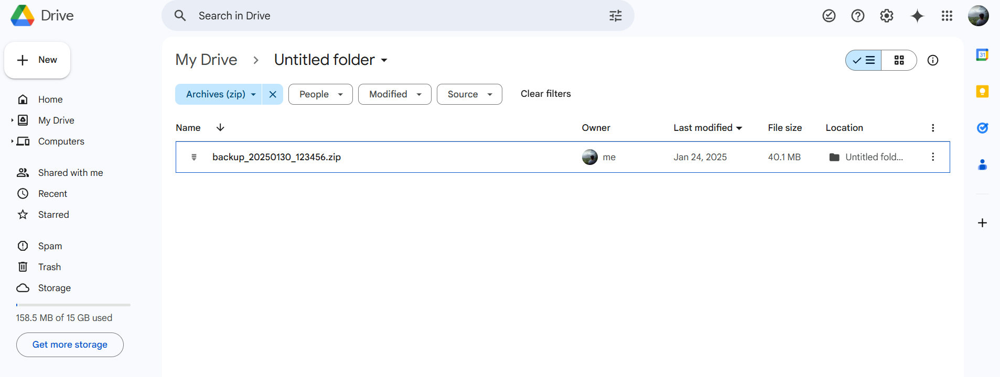

# Automated Backup Management Script

This repository contains a Bash script that automates the backup process for a specified project folder, implements a rotational backup strategy, and integrates with Google Drive using `rclone`. It also sends a cURL request upon successful backup.

## Table of Contents

- [Automated Backup Management Script](#automated-backup-management-script)
  - [Table of Contents](#table-of-contents)
  - [Overview](#overview)
  - [Requirements](#requirements)
  - [Installation](#installation)
  - [Configuration](#configuration)
  - [Usage](#usage)
    - [Example](#example)
  - [Google Drive Integration](#google-drive-integration)
    - [Setting Up rclone](#setting-up-rclone)
    - [Uploading Backups](#uploading-backups)
  - [Rotational Backup Strategy](#rotational-backup-strategy)
  - [Conclusion](#conclusion)

## Overview

The backup management script performs the following tasks:

1. Creates a timestamped ZIP archive from a specified project folder.
2. Uploads the backup to a designated folder on Google Drive.
3. Implements a rotational backup strategy to manage old backups.
4. Sends a cURL request to a specified URL upon successful backup.

## Requirements

- Bash shell (Linux or macOS)
- `zip` utility
- `rclone` for Google Drive integration
- `curl` for sending notifications

## Installation

1. **Clone this repository**:

```bash
git clone <GitHub_project_URL>
```

2. **Make the script executable**:

```bash
chmod +x backup_script.sh
```

3. **Install rclone**:
Follow the installation instructions from the [official rclone website](https://rclone.org/downloads/). For Ubuntu, you can use:

```bash
sudo apt update
sudo apt install rclone
```
4. **Install Unzip**:

```bash
sudo apt install unzip
unzip -v
```

5. **Install cURL**:
```bash
sudo apt install curl
curl --version
```

## Configuration

Before running the script, configure the following variables in the script:

- `SRC_DIR`: The source directory that needs to be backed up (passed as an argument).
- `BACKUP_DIR`: The local directory where backups will be stored (default is `$HOME/backups`).
- `GOOGLE_DRIVE_FOLDER`: The name of the folder in Google Drive where backups will be uploaded (default is `MyBackups`).
- `RETENTION_DAILY`: Number of daily backups to keep (default is 7).
- `RETENTION_WEEKLY`: Number of weekly backups to keep (default is 4).
- `RETENTION_MONTHLY`: Number of monthly backups to keep (default is 3).
- `CURL_URL`: An optional URL for sending a notification after a successful backup.

## Usage

To run the script, use the following command:

### Example
```bash
./backup_script.sh <Project_directory_path> "<cURL request>"
# Example:
./backup_script.sh /home/user/my_project "https://webhook.site/your-unique-url"
```

## Google Drive Integration

### Setting Up rclone

1. **Run rclone configuration**:
```bash
rclone config
```

2. **Follow the prompts** to create a new remote connection for Google Drive:
- Choose "n" for a new remote.
- Name your remote (e.g., `gdrive`).
- Select "drive" as the storage type.
- Follow authentication steps as prompted.

3. **Test your configuration** by running:
```bash
rclone lsd gdrive:
```

### Uploading Backups

The script uses `rclone copy` to upload backups to your specified Google Drive folder.

## Rotational Backup Strategy

The script implements a rotational backup strategy with customizable retention policies:

- **Daily Backups**: Keeps the last X daily backups (default is 7).
- **Weekly Backups**: Keeps the last X weekly backups (default is 4, retained on Sundays).
- **Monthly Backups**: Keeps the last X monthly backups (default is 3, retained on the first day of each month).

Older backups beyond these limits are automatically deleted according to this strategy.

## Conclusion

This automated backup management script provides an efficient way to ensure your project files are regularly backed up and easily accessible in Google Drive while managing older backups effectively.


